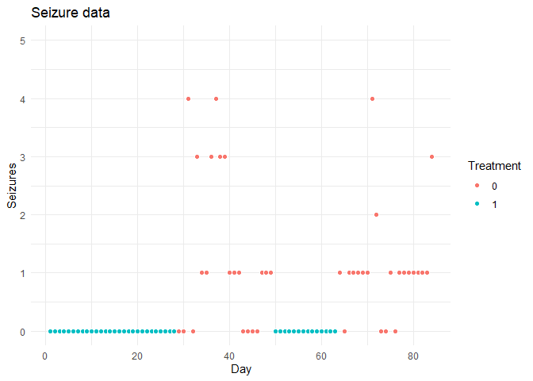

## Introduction

In this document I explain various ways of estimating treatment effects
in single-subject designs with blinded treatment allocation over time.
The motivating example is a patient with seizures, followed over 84
days, where treatment was allocated in 4 periods using an ABAB design.

The goal is to obtain an estimate of the treatment effect for this
patient. I will show several ways of obtaining this estimate, first by
simple visualization and summary statistics, and then by using a count
data model (Poisson regression). I will show how to do inference both in
the frequentist and in the Bayesian way, first by correcting the
standard errors and confidence intervals of the treatment effect for
potential model misspecification, and then by performing full Bayesian
inference.

Over the course of this document, we will use the following packages:

I have simulated some example data for illustrative purposes. This data
has three variables: the day of measurement (`treat`), the number of
seizures on that day (`y`), and whether treatment was administered on
that day (`treat`). A small sample of the data is shown below. The
script that generates the data is found in `gen_dat.R` in this folder.

``` r
df <- readRDS("example_data.rds")
head(df)
```

    ##   day y treat
    ## 1   1 0     1
    ## 2   2 0     1
    ## 3   3 0     1
    ## 4   4 0     1
    ## 5   5 0     1
    ## 6   6 0     1

## Visual analysis and summary statistics

The simplest way of getting an idea of the treatment effect is through
visual analysis and summary statistics. First, we create a plot of the
data over time, where the treatment periods are indicated:

``` r
ggplot(df, aes(x = day, y = y, fill = treat)) +
  geom_point(pch = 21, colour = "white", size = 2.3) +
  theme_minimal() +
  labs(x = "Day", y = "Seizures", fill = "Treatment", 
       title = "Seizure data") +
  ylim(0, 5)
```

<!-- -->

Using summary statistics, we can estimate the rate of seizures in both
the treatment and control periods

``` r
df |> 
  group_by(treat) |> 
  summarize(seizure_rate = mean(y))
```

    ## # A tibble: 2 x 2
    ##   treat seizure_rate
    ##   <fct>        <dbl>
    ## 1 0             1.21
    ## 2 1             0

This table shows that the expected seizure rate in the control condition
is 1.2 seizures per day, and the expected seizure rate in the treatment
condition is 0. Thus, we observe a difference in seizure rate of 1.2,
which is our first naïve estimate of the treatment effect.

However, we do not know anything yet about the uncertainty around this
effect. For this, we need a statistical model.

## Poisson regression for estimating the treatment effect

We will perform regression for estimating the treatment effect.
Specifically, we estimate the following model:

*y* ∼ *P**o**i**s**s**o**n*(*λ*)
*l**o**g*(*λ*) = *β*<sub>0</sub> + *β*<sub>1</sub> ⋅ treat

In other words, we model the seizures *y* using a Poisson distribution
with seizure rate *λ*. Then, the logarithm of this rate is the sum of a
base rate *β*<sub>0</sub> and a treatment effect *β*<sub>1</sub>. We use
the logarithm for technical reasons – it is the “canonical” link
function of the Poisson distribution – so we need to deal with this in
interpreting our parameters later.

The model can be estimated in `R` and summarized like so:

``` r
fit <- glm(y ~ 1 + treat, family = poisson(), data = df)
summary(fit)
```

    ## 
    ## Call:
    ## glm(formula = y ~ 1 + treat, family = poisson(), data = df)
    ## 
    ## Deviance Residuals: 
    ##      Min        1Q    Median        3Q       Max  
    ## -1.55839  -0.20065  -0.00006  -0.00006   1.99140  
    ## 
    ## Coefficients:
    ##              Estimate Std. Error z value Pr(>|z|)
    ## (Intercept)    0.1942     0.1400   1.387    0.166
    ## treat1       -20.4967  2398.1616  -0.009    0.993
    ## 
    ## (Dispersion parameter for poisson family taken to be 1)
    ## 
    ##     Null deviance: 119.899  on 83  degrees of freedom
    ## Residual deviance:  49.198  on 82  degrees of freedom
    ## AIC: 124.57
    ## 
    ## Number of Fisher Scoring iterations: 18

Here, we can see that our base rate (the rate in the control condition)
is *e*<sup>*β*<sub>0</sub></sup> = *e*<sup>0.19</sup> = 1.21 like
before. The estimated treatment effect is  − 20.49. Converting this into
an estimated treatment effect on the rate scale leads to
*e*<sup>*β*<sub>0</sub> + *β*<sub>1</sub></sup> = *e*<sup>−20.3</sup> ≈ 0.
In other words, the estimated rate difference 1.21 − 0 is very similar
to before.

So the parameter estimates make sense, but we see a huge uncertainty
around the estimate: the standard error is  \> 2000! This is another
technical issue: because the treatment condition has *no seizures*, it
is hard to estimate the log-rate and its uncertainty. Theoretically, the
maximum likelihood estimate for the rate is  − ∞ (as
*e*<sup>−∞</sup> = 0)!

## Penalized estimation of the Poisson model

There are several solutions for this which “regularize” the estimates to
be within a more reasonable range. One of the solutions is penalized
maximum likelihood estimation. In cases such as this one, penalized
estimation is shown to have better frequentist properties (such as
better calibrated standard errors and confidence intervals). Here we
refit the model with penalized estimation as implemented in the package
`brglm2`.

``` r
fit_pen <- glm(y ~ 1 + treat, family = poisson(), data = df, 
               method = "brglmFit")
summary(fit_pen)
```

    ## 
    ## Call:
    ## glm(formula = y ~ 1 + treat, family = poisson(), data = df, method = "brglmFit")
    ## 
    ## Deviance Residuals: 
    ##     Min       1Q   Median       3Q      Max  
    ## -1.5660  -0.2111  -0.1543  -0.1543   1.9777  
    ## 
    ## Coefficients:
    ##             Estimate Std. Error z value Pr(>|z|)   
    ## (Intercept)   0.2039     0.1393   1.463  0.14337   
    ## treat1       -4.6347     1.4211  -3.261  0.00111 **
    ## ---
    ## Signif. codes:  0 '***' 0.001 '**' 0.01 '*' 0.05 '.' 0.1 ' ' 1
    ## 
    ## (Dispersion parameter for poisson family taken to be 1)
    ## 
    ##     Null deviance: 119.904  on 83  degrees of freedom
    ## Residual deviance:  50.203  on 82  degrees of freedom
    ## AIC:  125.57
    ## 
    ## Type of estimator: AS_mixed (mixed bias-reducing adjusted score equations)
    ## Number of Fisher Scoring iterations: 1

Now the estimate and standard error are much more reasonable! The
treatment effect is estimated at -4.6, meaning a rate ratio of
*e*<sup>−4.6</sup> = 0.0097. The confidence interval is as follows:

``` r
confint(fit_pen)
```

    ##                   2.5 %     97.5 %
    ## (Intercept) -0.06920213  0.4770265
    ## treat1      -7.41995951 -1.8494985

This means that the treatment is expected to reduce the seizure rate by
a factor of *e*<sup>−7.42</sup> = 0.0006 to *e*<sup>−1.85</sup> = 0.15.
Thus, according to this model, not treating this patient leads to
between 6.36 and 1670 times higher seizure rate for this patient.

However, in this model we are making an assumption which does not
necessarily hold: that of uncorrelated residuals. We are assuming that
the seizure rates for each day are independent (conditional on
treatment). This would be the case if this were a randomized controlled
trial, but since this is a single-subject design we cannot make this
assumption. For example, it could be the case that a high seizure rate
on day 1 leads to a similarly high seizure rate on day 2. This would
lead to “serial correlation” or “autocorrelation”. As a result, we
cannot trust the confidence interval or the p-values in this section. In
the next section, I show how to compute standard errors which are robust
to mild model misspecification of this type.

## Robust inference for the Poisson model

Instead of using the default estimator for the standard errors, we will
now estimate a type of standard error which is robust to
heteroskedasticity and autocorrelation, the so-called “HAC”
estimator[1]. This is implemented in the `sandwich`package:

``` r
coeftest(fit_pen, vcov. = vcovHAC)
```

    ## 
    ## z test of coefficients:
    ## 
    ##             Estimate Std. Error z value  Pr(>|z|)    
    ## (Intercept)  0.20391    0.09809  2.0788   0.03763 *  
    ## treat1      -4.63473    0.74917 -6.1865 6.153e-10 ***
    ## ---
    ## Signif. codes:  0 '***' 0.001 '**' 0.01 '*' 0.05 '.' 0.1 ' ' 1

Note that in this case, the robust standard errors are smaller than the
default standard errors. This may not be the case (in fact usually they
are larger than the default ones!). Now we can perform our inference.

### Inference on rate ratio scale

According to the model, treatment significantly reduces the rate of
seizures (p \< .05). Not treating the patient is estimated to increase
the seizure rate by a factor *e*<sup>4.63</sup> = 103, which is our
estimated effect size on the rate ratio scale. We can compute robust 95%
confidence intervals for this effect as follows:

``` r
se_robust <- sqrt(diag(vcovHAC(fit_pen)))
lo <- round(exp(4.63473 - 1.96*se_robust[2]), 2)
hi <- round(exp(4.63473 + 1.96*se_robust[2]), 2)
cat("Robust 95% CI: [", lo, ", ", hi, "]", sep = "")
```

    ## Robust 95% CI: [23.72, 447.25]

This effect size seems very large (and it is!) but this is partially due
to the fact that there are no seizures at all in the treatment
condition. Because of this, it is sometimes better to look at the
absolute difference in rates.

### Inference on rate difference scale

To compute the rate difference, we compute expectations for the
treatment and the control conditions and then we subtract these. On the
rate difference scale, not treating the patient means a rate increase of
*e*<sup>0.20</sup> − *e*<sup>0.20 − 4.63</sup> = 1.21. We can compute
approximate robust 95% confidence intervals for this effect size
measures as follows:

``` r
se_robust <- sqrt(diag(vcovHAC(fit_pen)))
lo <- round(exp(0.20391 - 1.96*se_robust[1]) - 
            exp(0.20391 - 1.96*se_robust[1] - 
                4.63473 - 1.96*se_robust[2]), 2)
hi <- round(exp(0.20391 + 1.96*se_robust[1]) - 
            exp(0.20391 + 1.96*se_robust[1] - 
                4.63473 + 1.96*se_robust[2]), 2)
cat("Approx. robust 95% CI: [", lo, ", ", hi, "]", sep = "")
```

    ## Approx. robust 95% CI: [1.01, 1.42]

## Bayesian inference for the Poisson model

In order to obtain a Bayes factor for this treatment effect, we need to
estimate a Bayesian version of the “null model” – the model without
treatment effect – and the “alternative model” which includes the
treatment effect. Using the package `rstanarm` we can do this as
follows:

``` r
fit_null <- stan_glm(
  formula = y ~ 1, 
  family = poisson(), 
  data = df,
  diagnostic_file = "chains/null.csv"
)
fit_altr <- stan_glm(
  formula = y ~ 1 + treat, 
  family = poisson(), 
  data = df,
  diagnostic_file = "chains/altr.csv"
)
```

This performs fully Bayesian estimation, which also includes
regularizing non-informative priors which perform a similar job to the
penalized estimation in the frequentist setting. We can display the
parameter estimates of the alternative model like so:

``` r
coef(fit_altr)
```

    ## (Intercept)      treat1 
    ##   0.1815866  -5.4660703

Note that these estimates are reasonably similar: a seizure rate of
*e*<sup>0.18</sup> = 1.20 for the control condition, and a seizure rate
of *e*<sup>−5.46</sup> = 0.004 for the treatment condition.

We can get a Bayes factor for the treatment effect by comparing the two
models. Using the package `bridgesampling`, we first estimate the
“marginal likelihood” of each model[2]:

``` r
mlik_null <- bridge_sampler(fit_null)
mlik_altr <- bridge_sampler(fit_altr)
```

And then we can get a Bayes Factor by using the `bf()` function:

``` r
bf(mlik_altr, mlik_null)
```

    ## Estimated Bayes factor in favor of mlik_altr over mlik_null: 199825959748978.34375

This shows overwhelming evidence in favour of the alternative model.

## Bayesian inference accounting for autoregression

In the Bayesian setting, we cannot easily perform
autoregression-corrected inference like we do in the frequentist
setting. What we can do, however, is estimate our null and alternative
models with an explicit autoregression parameter, and then redo our
inference. For this, we include a “lagged” version of our outcome
variable `y` in the model.

First, we compute the lagged variable:

``` r
df <- 
  df |>
  mutate(yl = lag(y))

head(df)
```

    ##   day y treat yl
    ## 1   1 0     1 NA
    ## 2   2 0     1  0
    ## 3   3 0     1  0
    ## 4   4 0     1  0
    ## 5   5 0     1  0
    ## 6   6 0     1  0

Then, we can redo our model and marginal likelihood estimation including
this lagged variable:

``` r
fit_null_ar <- stan_glm(
  formula = y ~ 1 + yl, 
  family = poisson(), 
  data = df,
  diagnostic_file = "chains/null_ar.csv"
)
fit_altr_ar <- stan_glm(
  formula = y ~ 1 + treat + yl, 
  family = poisson(), 
  data = df,
  diagnostic_file = "chains/altr_ar.csv"
)
mlik_null_ar <- bridge_sampler(fit_null_ar)
mlik_altr_ar <- bridge_sampler(fit_altr_ar)
```

Lastly, we can compute the Bayes Factor for the treatment effect:

``` r
bf(mlik_altr_ar, mlik_null_ar)
```

    ## Estimated Bayes factor in favor of mlik_altr_ar over mlik_null_ar: 2834836854.85245

So even in this case, there is overwhelming evidence in favour of the
treatment effect.

[1] this is very common in econometrics, where researchers have to deal
with such time-series and within-subject changes all the time!

[2] In order to estimate Bayes factors with `bridgesampling`, in
`rstanarm` we need to save the model diagnostics somewhere. Hence the
use of the `diagnostic_file` in the model fitting process.
